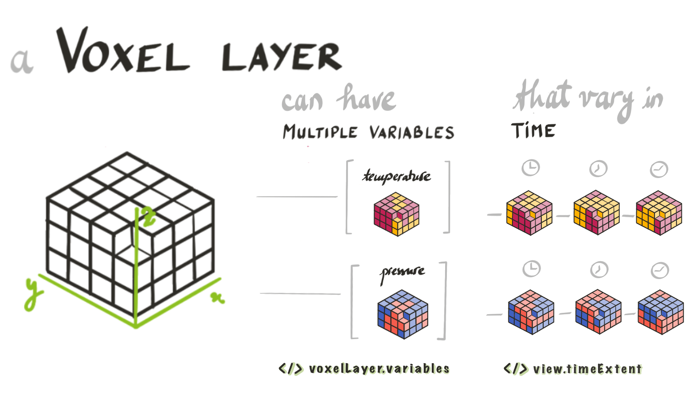
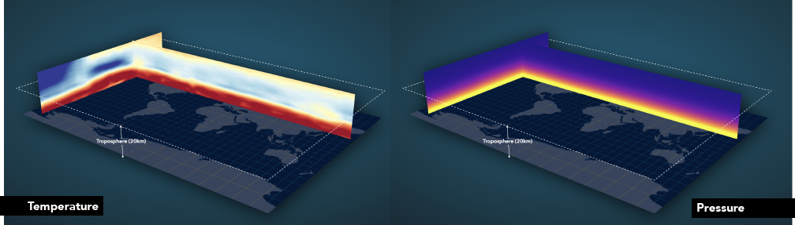
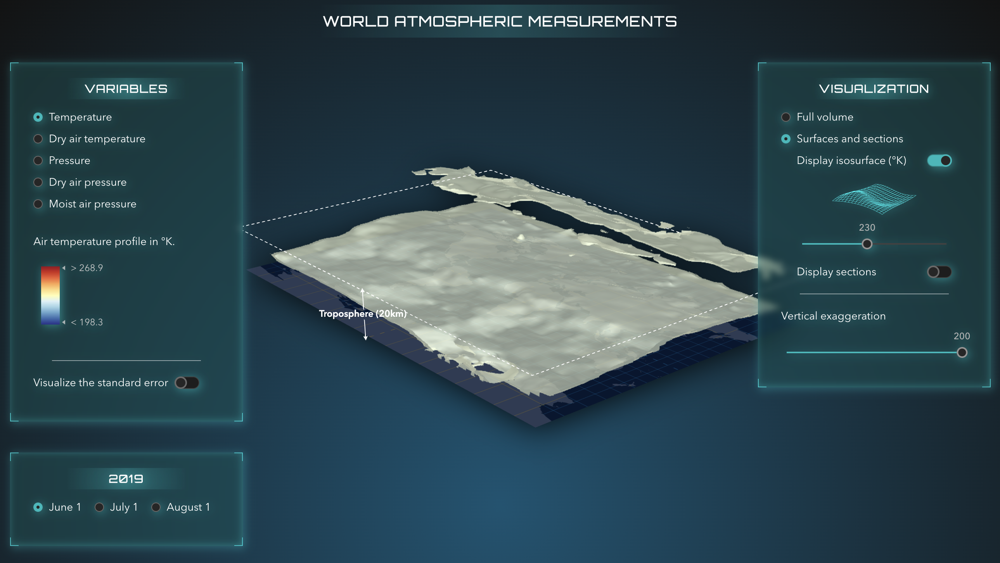

# Exploring world atmospheric temperature and pressure in 3D

This application displays atmospheric measurements like temperature and pressure over time in 3D.

[](https://geoxc-apps4.bd.esri.com/atmospheric-measurements/)
[Live link](https://geoxc-apps4.bd.esri.com/atmospheric-measurements/). Data provided by [GeoOptics Inc](https://geooptics.com/). Visualized with [ArcGIS API for JavaScript](https://developers.arcgis.com/javascript/latest/).

## What are atmospheric pressure and temperature?

Atmospheric pressure is the force exerted on a surface by the air above as gravity pulls it to the Earth. The temperature at different levels of the Earth's atmosphere is influenced by incoming solar radiation, humidity and of course by the altitude.

## How can we measure temperature and pressure at such high altitudes?

The technique involves a low earth orbit satellite receiving a signal from a GPS satellite. When it passes through the atmosphere, the signal is refracted along the way similar to how light refracts when it passes through a lens. The magnitude of the refraction depends on the density of the atmosphere, which depends on the temperature, air pressure and humidity. This technique is called radio occultation and it is a highly accurate weather forecasting tool.

## How to process and represent multidimensional temporal data?

The dataset that we are visualizing is provided by [GeoOptics](https://geooptics.com/), a company which specializes in radio occultations for weather forecasts. Each occultation event lasts less than a minute and produces a linear profile of between 350 and 400 observations from the top of the atmosphere to the bottom. The data are acquired from the altitude of 30km down to the ground level. The initial dataset contains around 600 occultation profiles that we then use to interpolate the measurements into a 3D surface. The geostatistical interpolation method is called Empirical Bayesian Kriging 3D. We then exported the 3D surface to a netCDF file that can then be viewed as voxel layers. [A voxel layer](https://pro.arcgis.com/en/pro-app/2.8/help/mapping/layer-properties/what-is-a-voxel-layer-.htm) is a representation of multidimensional spatial and temporal information in a 3D volumetric visualization. In the Esri world this is a type of layer and we can publish it to ArcGIS Online and visualize in a browser. Which is exactly what we did with this dataset, you can have a look at the voxel layer item [here](https://www.arcgis.com/home/item.html?id=aebb6c67172e4e1386887efe88fc687a).

## Voxel layers on the web - an explanation

Our voxel layer has multiple variables: x, y and z set the position in space and each voxel point has values for pressure and temperature over three days.



### Change variables

Within the ArcGIS API for JavaScript we can view the variables by accessing the array `voxelLayer.variables`.

For example atmospheric temperature is a variable stored like this:

```js
{
  description: "temperature_Prediction",
  id: 10,
  name: "temperature",
  unit: "degree_K"
}
```

We can switch between the different variables by setting the variable id on the layer:

```js
voxelLayer.currentVariableId = 10;
```

In ArcGIS API for JavaScript we set the time variable by setting the time extent on the sceneview.

If we compare the pressure and the temperature, we can see how pressure changes almost linearly with altitude, whereas temperature fluctuates much more because it doesn't only depend on altitude, but also on solar radiation and humidity.



### Render as surface or volume

We can switch from visualizing the whole volume to visualizing only parts of it. In JavaScript we do so by applying slices or by changing the `renderMode` property of the voxel layer to `surfaces`: `voxelLayer.renderMode = 'surfaces'`.
Like this we can display surfaces with the same variable value, also called isosurfaces:



If you created isosurface in ArcGIS Pro, they are saved on the layer and you can retrieve them in JavaScript: `voxelLayer.variableStyles.filter(style => style.variableId === selectedVariableId).getItemAt(0).isosurfaces`. Each variable has its own style and isosurfaces are part of that style.
In our demo application I am generating surfaces dynamically, to be able to slide through the whole volume. How does that work? When I switch to a new variable, I get the information about the range of values for that variable and connect that range to a slider:

```js
const style = voxelLayer.variableStyles.filter((style) => style.variableId === selectedVariable.id).getItemAt(0);
if (style && style.transferFunction) {
  const range = style.transferFunction.stretchRange;
  const isosurfaceInfo = {
    min: Math.round(range[0]),
    max: Math.round(range[1]),
    value: Math.floor((range[0] + range[1]) / 2)
  };
}

// we render the slider component based on isosurfaceInfo
<CalciteSlider
  labelHandles
  min={isosurfaceInfo.min}
  max={isosurfaceInfo.max}
  scale='m'
  value={isosurfaceInfo.value}
  snap
  step={isosurfaceInfo.max - isosurfaceInfo.min < 10 ? 0.2 : 1}
  onCalciteSliderInput={(event) => {
    const value = event.target.value;
    createIsosurface(value);
  }}
></CalciteSlider>;
```

As the user moves the slider, I create a single surface with the value of that slider:

```js
function createIsosurface(value) {
  const style = layer.variableStyles.filter((style) => style.variableId === selectedVariable.id).getItemAt(0);
  const color = layerView.getLockedColorForIsosurface(selectedVariable.id, value);
  if (style) {
    style.isosurfaces = [
      {
        value: value,
        enabled: true,
        color: { ...color, a: 0.8 }
      }
    ];
  }
}
```

### Visualize vertical sections

### Display the error in calculating those values

### Change the time variable

### Change the vertical exaggeration
