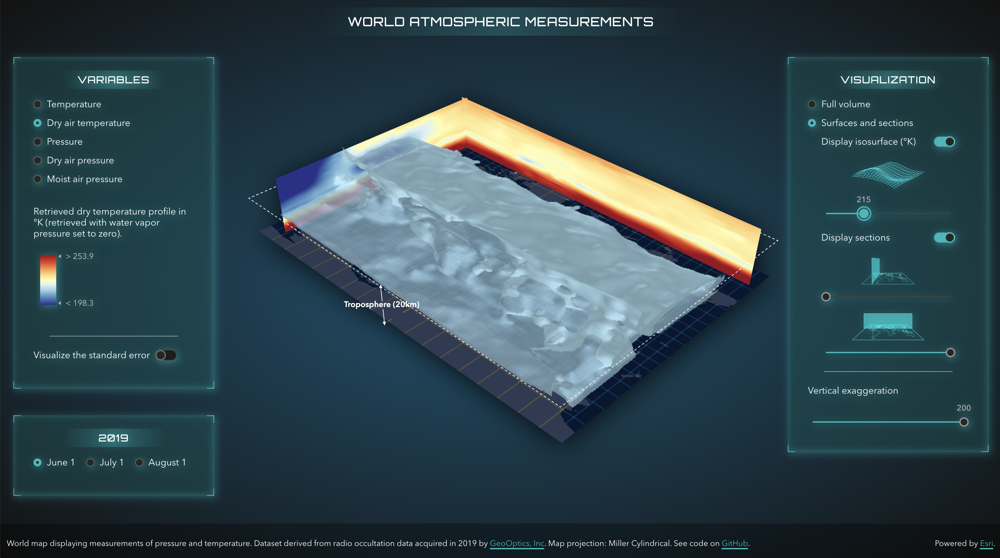

# Exploring world atmospheric temperature and pressure in 3D on the web

This application displays atmospheric measurements like temperature and pressure over time in 3D.

[](https://geoxc-apps4.bd.esri.com/atmospheric-measurements/)
[Live link](https://geoxc-apps4.bd.esri.com/atmospheric-measurements/). Data provided by [GeoOptics Inc](https://geooptics.com/). Visualized with [ArcGIS API for JavaScript](https://developers.arcgis.com/javascript/latest/).

## What are atmospheric pressure and temperature?

Atmospheric pressure is the force exerted on a surface by the air above as gravity pulls it to the Earth. The temperature at different levels of the Earth's atmosphere is influenced by incoming solar radiation, humidity and of course by the altitude.

## How can we measure temperature and pressure at such high altitudes?

The technique involves a low earth orbit satellite receiving a signal from a GPS satellite. When it passes through the atmosphere, the signal is refracted along the way similar to how light refracts when it passes through a lens. The magnitude of the refraction depends on the density of the atmosphere, which depends on the temperature, air pressure and humidity. This technique is called radio occultation and it is a highly accurate weather forecasting tool.

## How to process and represent multidimensional temporal data?

The dataset that we are visualizing is provided by [GeoOptics](https://geooptics.com/), a company which specializes in radio occultations for weather forecasts. Each occultation event lasts less than a minute and produces a linear profile of between 350 and 400 observations from the top of the atmosphere to the bottom. The data are acquired from the altitude of 30km down to the ground level. The initial dataset contains around 600 occultation profiles that we then use to interpolate the measurements into a 3D surface. The geostatistical interpolation method is called Empirical Bayesian Kriging 3D. We then exported the 3D surface to a netCDF file that can then be viewed as voxel layers. [A voxel layer](https://pro.arcgis.com/en/pro-app/2.8/help/mapping/layer-properties/what-is-a-voxel-layer-.htm) is a representation of multidimensional spatial and temporal information in a 3D volumetric visualization. In the Esri world this is a type of layer and we can publish it to ArcGIS Online and visualize in a browser. Which is exactly what we did with this dataset, you can have a look at the voxel layer item [here](https://www.arcgis.com/home/item.html?id=aebb6c67172e4e1386887efe88fc687a).

# Voxel layers on the web - an explanation

## Variables

Our voxel layer stores the spatial coordinates x, y and z and values for pressure and temperature variables over three days.


Within the ArcGIS API for JavaScript we can view the variables by accessing the array `voxelLayer.variables`.

For example atmospheric temperature is a variable stored like this:

```js
{
  description: "temperature_Prediction",
  id: 10,
  name: "temperature",
  unit: "degree_K"
}
```

We can switch between the different variables by setting the variable id on the layer:

```js
voxelLayer.currentVariableId = 10;
```

In ArcGIS API for JavaScript we set the time variable by setting the time extent on the sceneview: `view.timeExtent`.

If we compare the pressure and the temperature, we can see how pressure changes almost linearly with altitude, whereas temperature fluctuates much more because it doesn't only depend on altitude, but also on solar radiation and humidity.


## Rendering

A voxel layer can be rendered as a volume or as surfaces. To switch between the two we can set the `voxelLayer.renderMode` property to either `volume` or `surfaces`.

Depending on whether the variable is continuous or discrete, we can render it using stretch symbology or unique values. Each variable has its own symbology saved in `voxelLayer.variableStyles`. In our case we only have continuous values and we render them using the stretch symbology: `variableStyle.transferFunction` defines how the values are stretched between a minimum and maximum value that is associated with a color scheme. In case the variable has discrete values, the unique values are defined in `variableStyle.uniqueValues`.

### Isosurfaces

In case the variables are continuous we can create isosurfaces: surfaces with the same variable value. In a voxel layer we can visualize up to 4 isosurfaces at the same time.

Isosurfaces are part of the variable styles. For example, to get the isosurfaces for a selected variable : `voxelLayer.getVariableStyles(variableId).isosurfaces`.

In our demo application I am generating surfaces dynamically, to be able to explore the whole dataset. How does that work? When I switch to a new variable, I get the information about the range of values for that variable and connect that range to a slider:

```js
const style = voxelLayer.variableStyles.filter((style) => style.variableId === selectedVariable.id).getItemAt(0);
if (style && style.transferFunction) {
  const range = style.transferFunction.stretchRange;
  const isosurfaceInfo = {
    min: Math.round(range[0]),
    max: Math.round(range[1]),
    // middle value as the default value for the isosurface
    value: Math.floor((range[0] + range[1]) / 2)
  };
}

// we render the slider component based on isosurfaceInfo
<CalciteSlider
  labelHandles
  min={isosurfaceInfo.min}
  max={isosurfaceInfo.max}
  scale='m'
  value={isosurfaceInfo.value}
  snap
  step={isosurfaceInfo.max - isosurfaceInfo.min < 10 ? 0.2 : 1}
  onCalciteSliderInput={(event) => {
    const value = event.target.value;
    createIsosurface(value);
  }}
></CalciteSlider>;
```

As the user moves the slider, I create a single surface with the value of that slider:

```js
function createIsosurface(value) {
  const style = layer.variableStyles.filter((style) => style.variableId === selectedVariable.id).getItemAt(0);
  const color = layer.getColorForContinuousDataValue(selectedVariable.id, value, false);
  if (style) {
    style.isosurfaces = [
      {
        value: value,
        enabled: true,
        color: { ...color, a: 0.8 },
        // if the color is not locked, we can override it
        colorLocked: false
      }
    ];
  }
}
```


### Sections

A section is a two-sided vertical or horizontal plane cutting through a voxel layer. Creating sections allows us to analyze profiles in the data. You can lock a section, so that it also displays when changing the variable and be able to compare several variables like this.

In our application I'm dynamically generating the sections, to be able to explore vertical temperature profiles at any location. To define a VoxelDynamicSection we set a point that the plane should pass through, an orientation and a tilt for the plane:

.

The point is defined in voxel space, so we'll need to retrieve the voxel dimensions:

```js
const dimensions = voxelLayer.getVolume().sizeInVoxels;
```

When the layer loads, I am generating slices for each point on the x and y axis:

```js
const sections = [];
for (let i = 1; i < dimensions[0]; i++) {
  sections.push({ enabled: false, label: `x-${i}`, orientation: 90, tilt: 90, point: [i, 0, 0] });
}
for (let i = 1; i < dimensions[1]; i++) {
  sections.push({ enabled: false, label: `y-${i}`, orientation: 180, tilt: 90, point: [0, i, 0] });
}
layer.volumeStyles.getItemAt(0).dynamicSections = sections;
```

Then I am using the slider individually enable or disable them:

```js
<CalciteSlider
  min={1}
  max={dimensions[0]}
  scale='m'
  snap
  step='1'
  onCalciteSliderInput={(event) => {
    const value = event.target.value;
    layer.volumeStyles.getItemAt(0).dynamicSections.forEach((section) => {
      if (section.label === `x-${value}`) {
        section.enabled = true;
      } else {
        section.enabled = false;
      }
      return section;
    });
  }}
></CalciteSlider>
```

### Slice the layer

Slices can be used to define areas of interest. Slices apply to both volume and surfaces visualizations. In our application we're slicing the layer vertically from east to west and south to north, but also horizontally from top to bottom. Similar to a section, a slice is also defined by a point, an orientation and a tilt value. Let's take the example of slicing from top to bottom. In that case the slice can have any orientation, the tilt is 0 and the point's z axis is important to give the height at which we want to slice the layer:

```js
const getSlice = (heightValue) => {
  return new VoxelSlice({
    tilt: 0,
    point: [0, 0, heightValue]
  });
};
```


### Change the vertical exaggeration

In our application we need vertical exaggeration, otherwise we wouldn't be able to see the variation of the values on the z axis. Try it out, make the exaggeration equal to 1 and see what the real world height looks like.
